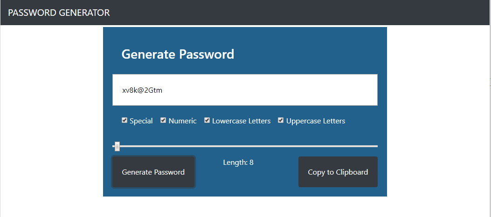

# Password-Generator

## Unit 03 JavaScript Homework: Password Generator

## Description
This application generates a random password based on user-selected criteria. This app will run in the browser and feature dynamically updated HTML and CSS powered by a JavaScript code.

## How to use the web application?

1. The user will be prompted to choose from the following password criteria:
 * Length (must be between 8 and 128 characters)
 * Special characters (see examples)
 * Numeric characters
 * Lowercase characters
 * Uppercase characters
 
2. The user will then choose the length of the password by navigating to the scroll bar (8 min. - 128 max. characters).

3. Once the Generate Password button is clicked, a generated password will show up on the text box. This application should validate user input and ensure that at least one character type is selected.

4. Press "Copy to Clipboard" button to copy it.

## User Story
As an employee with access to sensitive data
an employee needs random generated password for greater security.

## Business Context
For companies that handle large amounts of sensitive data, weak passwords can pose a real security threat. An application that can generate strong passwords quickly and effortlessly saves employees time and ensures secure access to data.

## Acceptance Criteria
 * Given that a user needs a new, secure password
 when prompted for password criteria
 then a password is generated

## Build With
* JavaScript
* HTML
* CSS

## License
This project is licensed under the MIT License - see the LICENSE.md file for details
