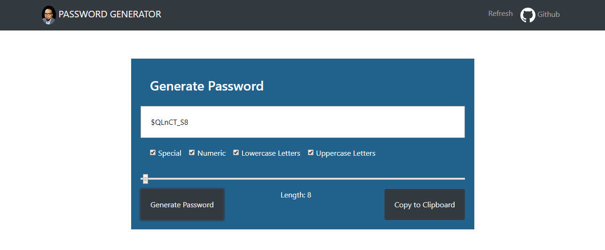
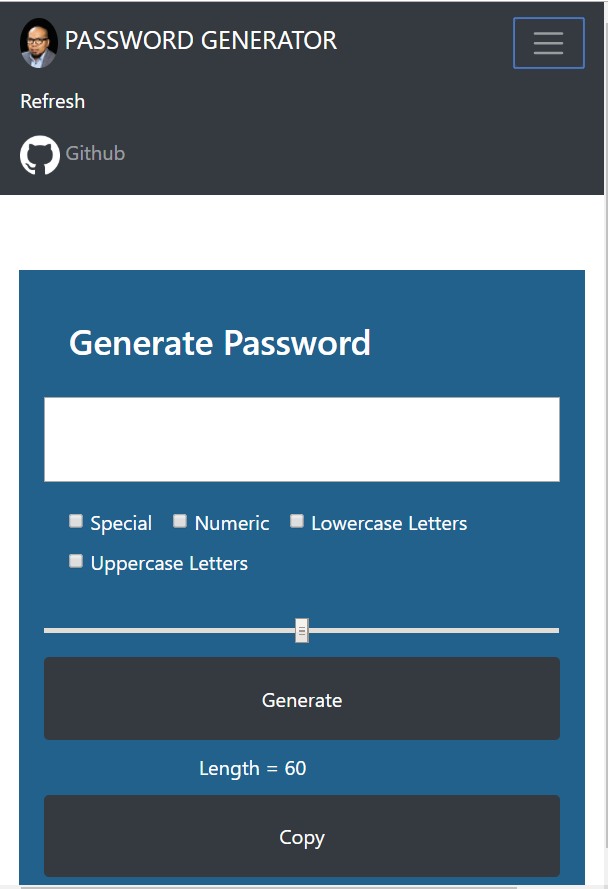

# Password-Generator

## JavaScript: Password Generator

## Description
This application generates a random password based on user-selected criteria. This app will run in the browser and feature dynamically updated HTML and CSS powered by a JavaScript code.

 * The NAVBAR includes an image photo of the creator, a refresh button and link to Github to see the code.
 * The page is responsive to destops, tablets and phones. 

## How does it work?

User can select multiple criteria from the checkbox:
 
 * Special characters 
 * Numeric characters
 * Lowercase letters
 * Uppercase letters
 * Length (must be between 8 and 128 characters)

This application validates user input and ensure that at least one character type is selected. If no selection was made 
from the criteria, the program throws an error and asks the user to select at least one criteria.
Once a criteria is selected, the user will be presented with a password matching the criteria. 
The user also have the option to click a button to copy the password to the clipboard.

## Business Context
For companies that handle large amounts of sensitive data, weak passwords can pose a real security threat. An application that can generate strong passwords quickly and effortlessly saves employees time and ensures secure access to data.

## Acceptance Criteria
 * Given that a user needs a new, secure password,
 when prompted for password criteria
 then a password is generated

## Build With
* JavaScript
* HTML
* CSS

## Links

## License
This project is licensed under the MIT License - see the LICENSE.md file for details
